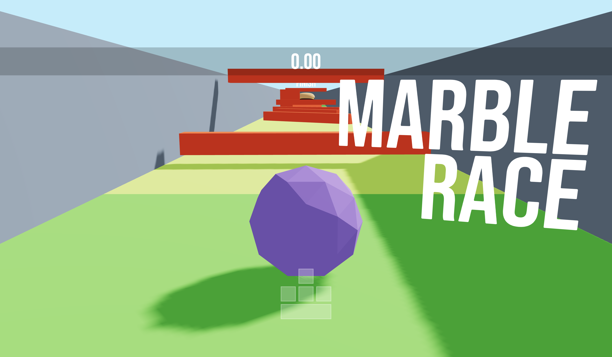

<h1 align="center">
<br>
Marble race game 
<br>
</h1>
<h4 align="center">Made with Three.js and R3F</h4>



## Run the App
**Clone the repository**:
```sh
git clone https://github.com/elizanierwinska/Marble-race-game.git
```

**Install all the dependencies:**<br>
npm
```sh
npm install 
```
yarn
```sh
yarn install
```
pnpm
```sh
pnpm install
```

**In the project directory run**: 
```sh
npm run dev
```

This will run the application in the development mode.


## Information about the project

Marble race game is a simple 3D game, where a player could control the marble through a track with obstacles.

### Features
* **Obstacles**: There are three different given obstacles: twister (spinning), limbo (going up and down), and axe (going left and right). All of them appear in a random sequence.
* **Controls**: Player can control the marble's movement using arrow/WASD keys with spacebar.
* **Timer**: Indicates how long it took for player to finish the obstacle course.
* **Restart button**: At the end of obstacle course *restart button* appears. When the player clicks it, the marble is set to the initial position, the timer is reset, and the new set of obstacles is created.
* **Keybord interface**: Shows the arrow/WASD keys and spacebar. The input key is highlighted when the player is pressing the corresponding key.

## This project was built with:
* Blender
* Three.js
